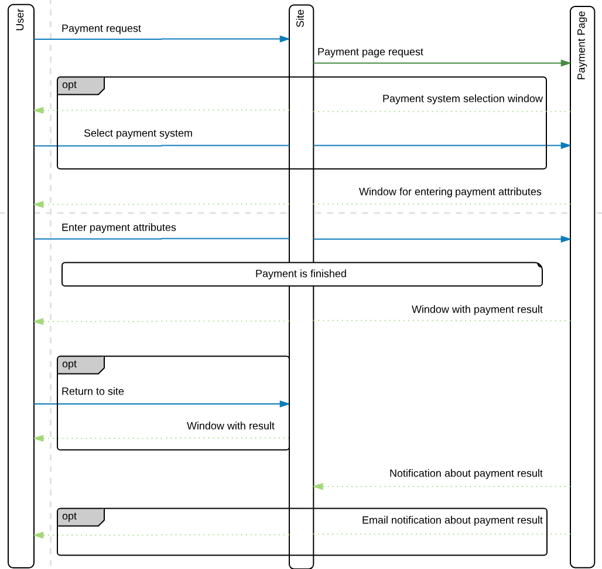

[](https://travis-ci.com/ITechPSP/paymentpage-sdk-go)

# ITechPSP payment page SDK

This is a set of libraries in the Go language to ease integration of your service
with the ITechPSP Payment Page.

## Payment flow



### Installation

Simply use go get:

`go get github.com/ITechPSP/paymentpage-sdk-go`

To update later:

`go get -u github.com/ITechPSP/paymentpage-sdk-go`

### Get URL for payment

```go
import "github.com/ITechPSP/paymentpage-sdk-go"

payment := paymentpage.NewPayment(11, "test_payment_id")
payment.SetParam(paymentpage.ParamPaymentCurrency, "EUR")
payment.SetParam(paymentpage.ParamPaymentAmount, 1000)

gate := paymentpage.NewGate("your project secret")
paymentPageUrl := gate.GetPaymentPageUrl(*payment)
``` 

`paymentPageUrl` here is the signed URL.

### Handle callback from ITechPSP

You'll need to autoload this code in order to handle notifications:

```go
import "github.com/ITechPSP/paymentpage-sdk-go"

gate := paymentpage.NewGate("your project secret")
callback, err := gate.HandleCallback(data)
```

`data` is the JSON string received from payment system;

`err` nil or error interface; error returned if signature invalid or callback data can't parse;

`callback` is the Callback object describing properties received from payment system;
`callback` implements these methods: 
1. `callback.GetPaymentStatus()`
    Get payment status.
2. `callback.GetPayment()`
    Get all payment data.
3. `callback.GetPaymentId()`
    Get payment ID in your system.
